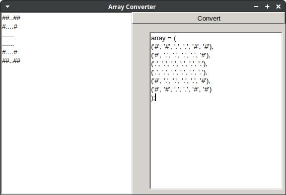
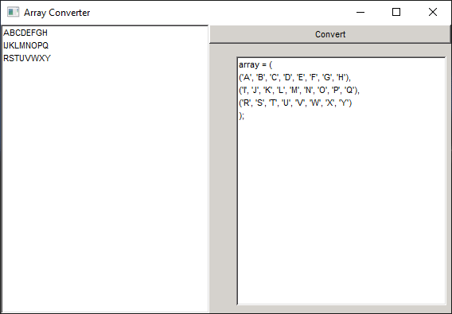

# arrayConverter
Tool to convert text to array of characters, used for roguelike development.

Paste text into the panel on the left and click 'Convert'.
A Pascal array will be generated on the right.

On the [Releases page](https://github.com/cyberfilth/arrayConverter/releases/tag/v1) there are links to Windows and Linux binaries.

This tool uses [fpGUI](https://github.com/graemeg/fpGUI)
